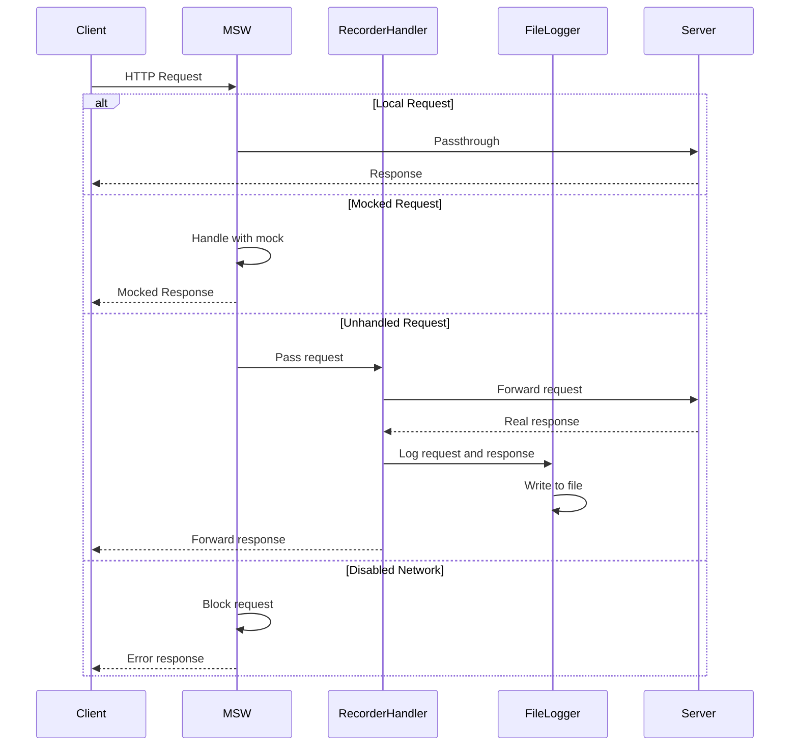

```mermaid
sequenceDiagram
    participant Client
    participant MSW
    participant RecorderHandler
    participant FileLogger
    participant Server

    Client->>MSW: HTTP Request
    alt Local Request
        MSW->>Server: Passthrough
        Server-->>Client: Response
    else Mocked Request
        MSW->>MSW: Handle with mock
        MSW-->>Client: Mocked Response
    else Unhandled Request
        MSW->>RecorderHandler: Pass request
        RecorderHandler->>Server: Forward request
        Server-->>RecorderHandler: Real response
        RecorderHandler->>FileLogger: Log request and response
        FileLogger->>FileLogger: Write to file
        RecorderHandler-->>Client: Forward response
    else Disabled Network
        MSW->>MSW: Block request
        MSW-->>Client: Error response
    end
```
