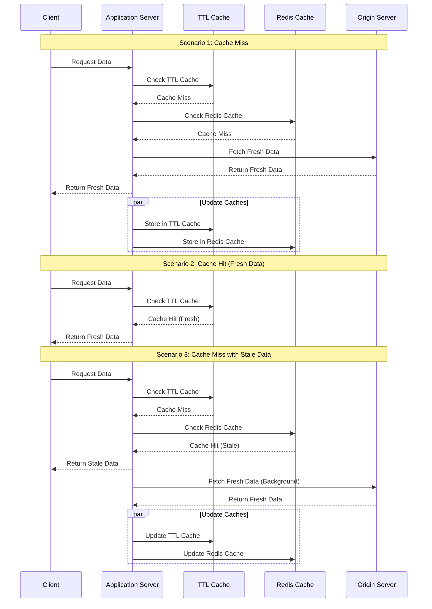

<!-- rehype takes more effort so we'll generate it for it -->

```mermaid
sequenceDiagram
    participant Client
    participant App as Application Server
    participant TTL as TTL Cache
    participant Redis as Redis Cache
    participant Origin as Origin Server

    Note over Client,Origin: Scenario 1: Cache Miss

    Client->>App: Request Data
    App->>TTL: Check TTL Cache
    TTL-->>App: Cache Miss
    App->>Redis: Check Redis Cache
    Redis-->>App: Cache Miss
    App->>Origin: Fetch Fresh Data
    Origin-->>App: Return Fresh Data
    App-->>Client: Return Fresh Data
    par Update Caches
        App->>TTL: Store in TTL Cache
        App->>Redis: Store in Redis Cache
    end

    Note over Client,Origin: Scenario 2: Cache Hit (Fresh Data)

    Client->>App: Request Data
    App->>TTL: Check TTL Cache
    TTL-->>App: Cache Hit (Fresh)
    App-->>Client: Return Fresh Data

    Note over Client,Origin: Scenario 3: Cache Miss with Stale Data

    Client->>App: Request Data
    App->>TTL: Check TTL Cache
    TTL-->>App: Cache Miss
    App->>Redis: Check Redis Cache
    Redis-->>App: Cache Hit (Stale)
    App-->>Client: Return Stale Data
    App->>Origin: Fetch Fresh Data (Background)
    Origin-->>App: Return Fresh Data
    par Update Caches
        App->>TTL: Update TTL Cache
        App->>Redis: Update Redis Cache
    end
```
